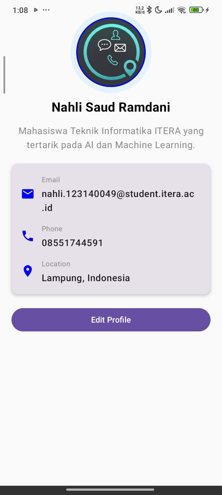

# My Profile App

Sebuah aplikasi Android modern yang dibangun menggunakan **Jetpack Compose** untuk menampilkan profil pribadi dengan sentuhan animasi yang interaktif.

## Fitur Utama
- **Animasi Entrance**: Menggunakan `AnimatedVisibility` dengan kombinasi `fadeIn` dan `slideInVertically` saat aplikasi pertama kali dibuka untuk memberikan kesan yang *smooth* dan premium.
- **Header Profil**: Menampilkan foto profil melingkar dengan border kustom dan efek bayangan yang elegan.
- **Bio Singkat**: Penjelasan mengenai latar belakang akademik dan minat teknologi.
- **Kartu Informasi Kontak**: Detail kontak (Email, Telepon, Lokasi) yang dibungkus dalam `Material3 Card` dengan penggunaan ikon yang informatif.
- **UI/UX Modern**: Desain bersih dengan latar belakang kontras dan layout yang responsif menggunakan Material Design 3.

## Teknologi yang Digunakan
- **Bahasa Pemrograman**: [Kotlin](https://kotlinlang.org/)
- **UI Framework**: [Jetpack Compose](https://developer.android.com/jetpack/compose)
- **Animasi**: Compose Animation (`AnimatedVisibility`, `tween`, `slideInVertically`).
- **Design System**: Material Design 3 (M3).
- **Icons**: Material Icons Default.

## Tampilan Aplikasi

**Detail Profil:**
- **Nama**: Nahli Saud Ramdani
- **Institusi**: Mahasiswa Teknik Informatika ITERA
- **Minat**: Artificial Intelligence & Machine Learning

## Cara Menjalankan
1. **Clone** repositori ini ke komputer lokal Anda.
2. Buka proyek menggunakan **Android Studio (Ladybug atau versi terbaru)**.
3. Tunggu hingga proses **Gradle Sync** selesai.
4. Jalankan pada **Emulator** atau **Perangkat Fisik** Android.

