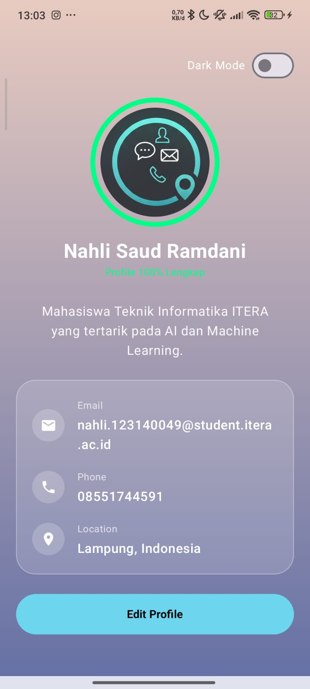
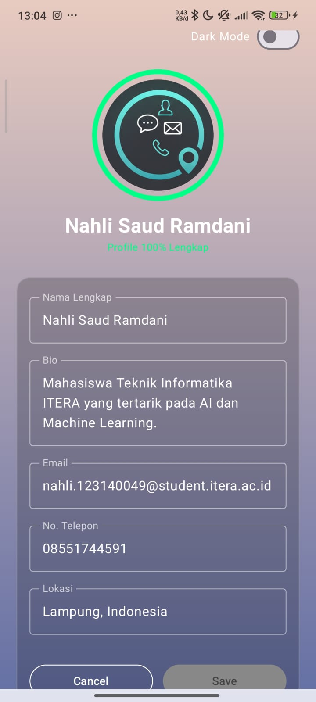
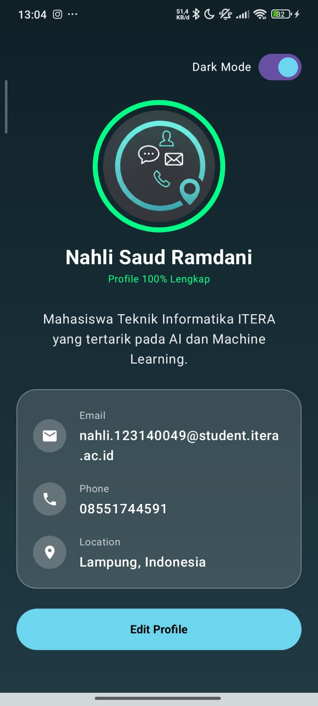

# My Profile App V2 🚀

Sebuah aplikasi Android modern berbasis **Jetpack Compose** yang dirancang dengan pendekatan **MVVM (Model-View-ViewModel)**. Aplikasi ini memungkinkan pengguna untuk melihat dan mengelola informasi profil dengan antarmuka yang dinamis, interaktif, dan penuh estetika.

## ✨ Fitur Unggulan

### 1. **Sistem Edit Profil Dinamis**
- Mendukung transisi mulus antara mode tampilan dan mode edit menggunakan `AnimatedContent`.
- Validasi input *real-time*: Tombol **Save** hanya akan aktif jika Nama dan Bio terisi dan terdapat perubahan data dari versi asli.
- Sinkronisasi data otomatis antara form edit dan state utama.

### 2. **Completeness Meter (Indikator Kelengkapan)**
- Terdapat `CircularProgressIndicator` di sekeliling foto profil yang menunjukkan persentase kelengkapan data profil (0-100%).
- Animasi progress yang *smooth* menggunakan `animateFloatAsState`.

### 3. **Desain Glassmorphism & Modern UI**
- Implementasi efek "Kaca" (Glassmorphism) pada kartu informasi menggunakan komposisi transparansi `alpha` dan border halus.
- Latar belakang menggunakan **Dynamic Gradient** yang berubah warna secara dramatis saat berpindah mode.
- Tipografi dan komponen sepenuhnya menggunakan **Material Design 3**.

### 4. **Dark Mode & Tema Dinamis**
- Fitur *Dark Mode* manual yang merubah skema warna aplikasi secara keseluruhan dengan transisi warna yang halus (`animateColorAsState`).

### 5. **Haptic Feedback & UX Interaktif**
- Memberikan respon getaran (*haptic*) pada setiap aksi penting seperti menekan tombol edit, menyimpan data, atau mengubah tema, memberikan sensasi fisik yang lebih nyata bagi pengguna.
- Integrasi **Snackbar** untuk memberikan notifikasi sukses setelah pembaruan profil.

---

## 🛠️ Teknologi yang Digunakan

| Komponen | Teknologi |
| --- | --- |
| **Bahasa** | Kotlin |
| **UI Framework** | Jetpack Compose (Material 3) |
| **Arsitektur** | MVVM (Model-View-ViewModel) |
| **State Management** | StateFlow & ViewModel |
| **Animasi** | Compose Animation (`AnimatedContent`, `animate*AsState`, `tween`) |
| **Feedback** | Haptic Feedback & Snackbar |

---

## 🏗️ Struktur Proyek

- **`data/ProfileUiState.kt`**: Single source of truth yang menyimpan status UI, data profil asli, data form sementara, dan logika kalkulasi kelengkapan.
- **`viewmodel/ProfileViewModel.kt`**: Menangani logika bisnis, pembaruan state, dan manajemen event UI.
- **`MainActivity.kt`**: Berisi UI utama yang reaktif terhadap perubahan state di ViewModel.

---

## 📸 Tampilan Aplikasi

---

## 🚀 Cara Menjalankan

1. **Clone** repositori ini ke direktori lokal Anda.
2. Buka proyek menggunakan **Android Studio (Ladybug 2024.2.1)** atau versi terbaru.
3. Pastikan koneksi internet stabil untuk proses **Gradle Sync**.
4. Hubungkan perangkat fisik Android atau jalankan **Emulator**.
5. Klik tombol **Run 'app'**.

---

**Dibuat oleh:**  
**Nahli Saud Ramdani** (123140049)
