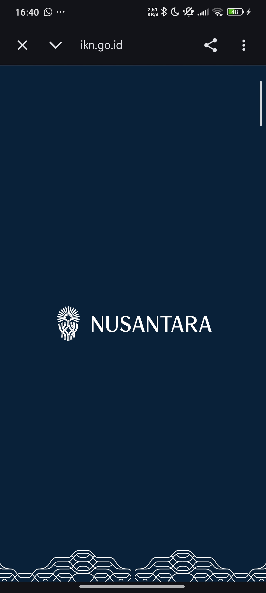

# 📰 NewsReaderApp - Berita Indonesia

NewsReaderApp adalah aplikasi pembaca berita modern berbasis Android yang dibangun menggunakan **Jetpack Compose**. Aplikasi ini dirancang dengan antarmuka yang bersih, mendukung mode gelap, dan memiliki fitur *offline caching* yang handal.

## 🚀 Fitur Utama
- **Modern UI & Dark Mode:** Tampilan estetik dengan palet warna Navy & Charcoal yang nyaman di mata.
- **Offline Caching (Local Storage):** Berita tetap bisa dibaca meskipun tanpa koneksi internet berkat integrasi Room Database.
- **Shimmer Effect:** Pengalaman loading yang halus menggunakan *skeleton screen* (Shimmer).
- **Chrome Custom Tabs:** Membuka artikel asli langsung di dalam aplikasi tanpa harus pindah ke browser eksternal.
- **Randomized Updates:** Simulasi pembaruan berita setiap kali melakukan *refresh*.

## 🛠️ Tech Stack
- **Jetpack Compose (Material 3):** Toolkit modern untuk membangun UI deklaratif.
- **Ktor Client:** Digunakan untuk menangani permintaan jaringan (Networking).
- **Room Persistence:** Database lokal untuk penyimpanan berita (Offline Caching).
- **Coil:** Library pemuat gambar yang cepat dan efisien.
- **Compose Navigation:** Navigasi antar layar yang mulus.
- **MVVM Architecture:** Pola desain untuk kode yang rapi dan mudah dikelola.

## 📸 Screenshots
Berikut adalah tampilan aplikasi dalam berbagai state:

| Halaman Utama (Home) | Detail Berita | Tampilan Browser |
| :---: | :---: | :---: |
|  |  |  |

## 🔌 API & Data
Aplikasi saat ini mengimplementasikan **Repository Pattern** dengan strategi *Local-First*:
1. **Local:** Data pertama kali dimuat dari Room Database.
2. **Mock Remote:** Aplikasi mensimulasikan pengambilan data dari API berita Indonesia melalui `NewsRepositoryImpl` dengan kumpulan data yang dinamis.
3. **Synchronization:** Setiap data baru yang didapat otomatis disimpan ke dalam cache lokal untuk akses offline di kemudian hari.

---

## 👤 Identitas Pengembang
- **Nama:** Nahli Saud Ramdani
- **NIM:** 123140049

