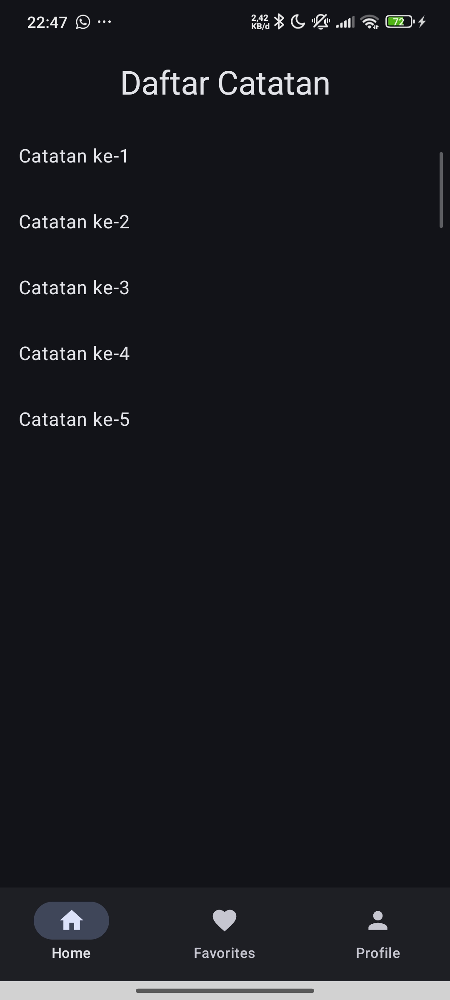
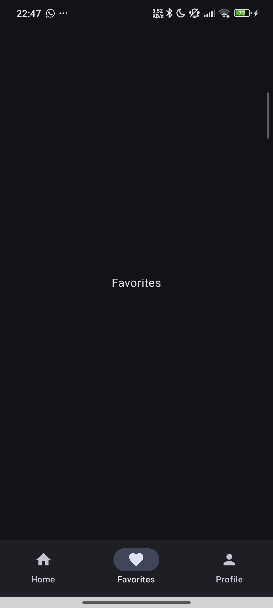
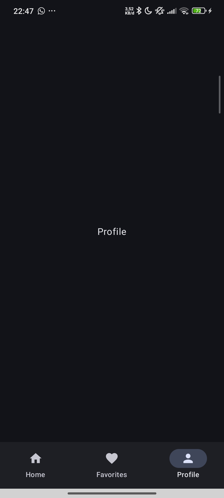

# Notes App Navigation Checklist
LATIHAN 3: BOTTOM NAVIGATION
- [x] BottomNavItem sealed class
- [x] NavigationBar component
- [x] NavigationBarItem untuk setiap tab
- [x] currentBackStackEntry untuk selected state
- [x] Scaffold dengan bottomBar
- [x] NavHost di content
- [x] 3 screen composables
- [x] Test tab switching

## Tampilan Aplikasi
| Home | Favorites | Profile |
| :---: | :---: | :---: |
|  |  |  |
