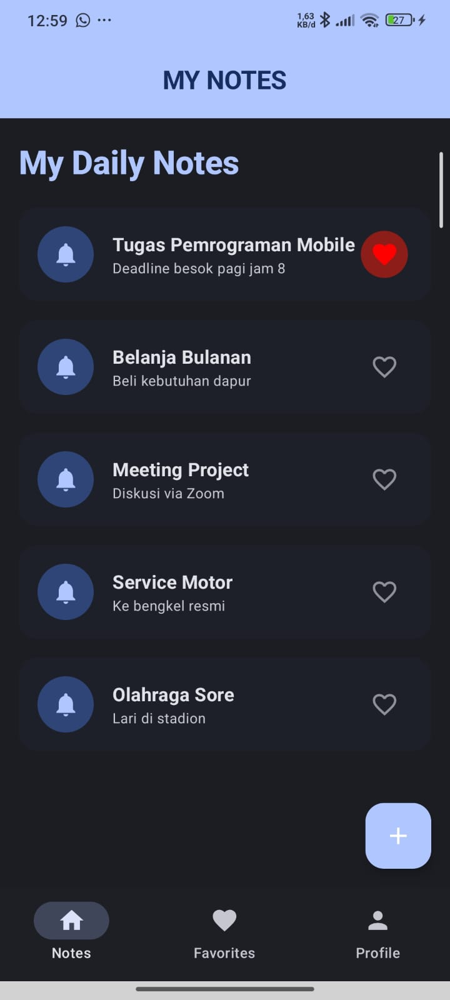
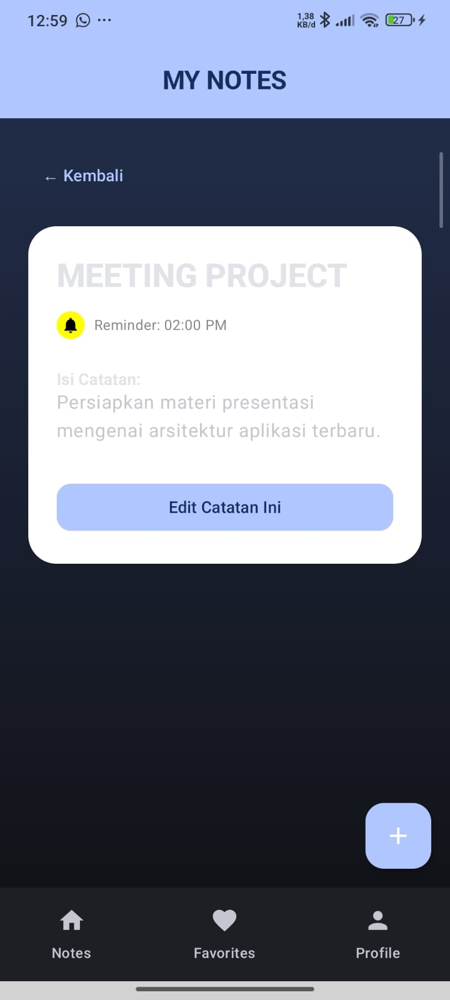
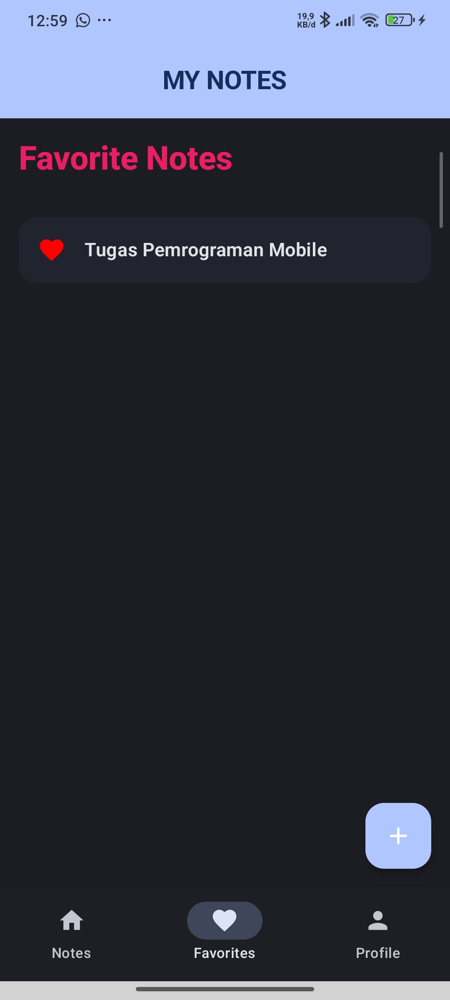
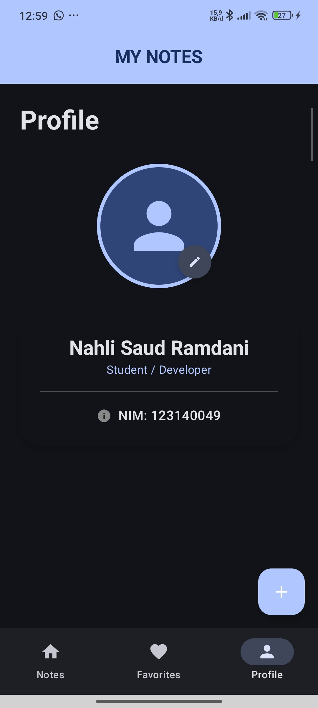

# Notes App Navigation 📝

Project ini adalah aplikasi catatan modern yang dibangun menggunakan **Jetpack Compose**. Aplikasi ini tidak hanya mendemonstrasikan sistem navigasi, tetapi juga implementasi UI yang estetik dan pengelolaan data dinamis menggunakan State di Android.

## Fitur Utama & Pembelajaran

### 1. Navigasi Lanjutan & Arsitektur
- **Sealed Class Routes**: Penggunaan `Screen` dan `BottomNavItem` untuk rute navigasi yang terpusat dan *type-safe*.
- **Bottom Navigation**: Sistem tab menu (Home, Favorites, Profile) dengan manajemen *backstack* yang dioptimasi (`saveState`, `restoreState`).
- **Dynamic Navigation**: Berpindah antar layar sambil membawa data (`noteId`) melalui `navArgument`.

### 2. Pengelolaan Data Dinamis (State Management - Full CRUD)
- **Create**: Menambah catatan baru melalui `AddNoteScreen` dengan auto-increment ID.
- **Read**: Menampilkan daftar catatan dinamis di Home dan Favorites, serta detail lengkap di `NoteDetailScreen`.
- **Update**: Mengubah isi catatan (Judul, Deskripsi, Konten, Reminder) melalui `EditNoteScreen`.
- **State Handling**: Menggunakan `mutableStateListOf` agar sinkronisasi data terjaga di seluruh layar secara *real-time*.

### 3. UI Estetik & Material 3
- **Custom Components**: `NoteItem` dengan desain kartu kustom, ikon notifikasi, dan indikator status.
- **Visual Polish**: Penggunaan *Gradient Background*, *Tonal Elevation*, dan *Custom Shapes* untuk tampilan yang lebih modern.
- **Profile UI**: Tampilan profil dengan foto, tombol edit, dan kartu informasi detail NIM.

## Tampilan Aplikasi

### Video Demo
https://github.com/user-attachments/assets/6300f394-8208-40b1-a16c-41ffd449e1d6

### Screenshot
| Home / Notes | Detail Note |
|---|---|
|  |  |

| Favorites | Profile |
|---|---|
|  |  |

## Struktur Layar
- **Home (My Daily Notes)**: Daftar catatan interaktif dengan ringkasan tugas dan status favorit.
- **Note Detail**: Layar detail dengan tampilan kartu lebar, informasi reminder, dan isi konten yang unik tiap catatan.
- **Favorites**: Menampilkan koleksi catatan yang disukai, lengkap dengan fitur klik untuk melihat detail.
- **Profile**: Informasi pengguna dengan layout yang rapi dan fungsional.

## Teknologi yang Digunakan
- **Jetpack Compose**: Untuk membangun UI deklaratif.
- **Compose Navigation**: Library utama untuk perpindahan antar layar.
- **Material 3**: Menggunakan standar desain terbaru dari Google.
- **Kotlin State & Models**: Untuk logika data yang dinamis.

---
**Oleh:**
- Nahli Saud Ramdani (123140049)
