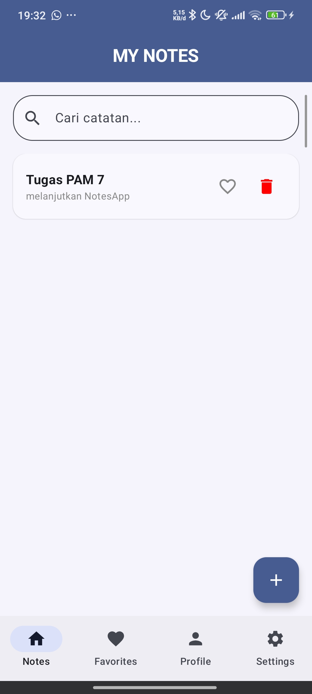
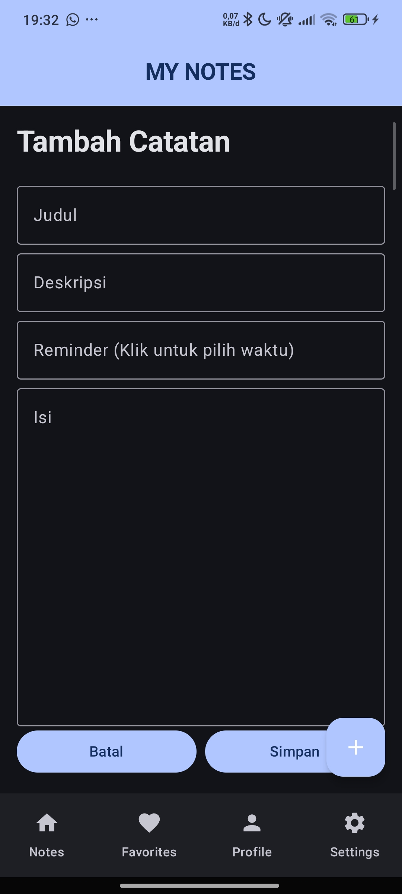
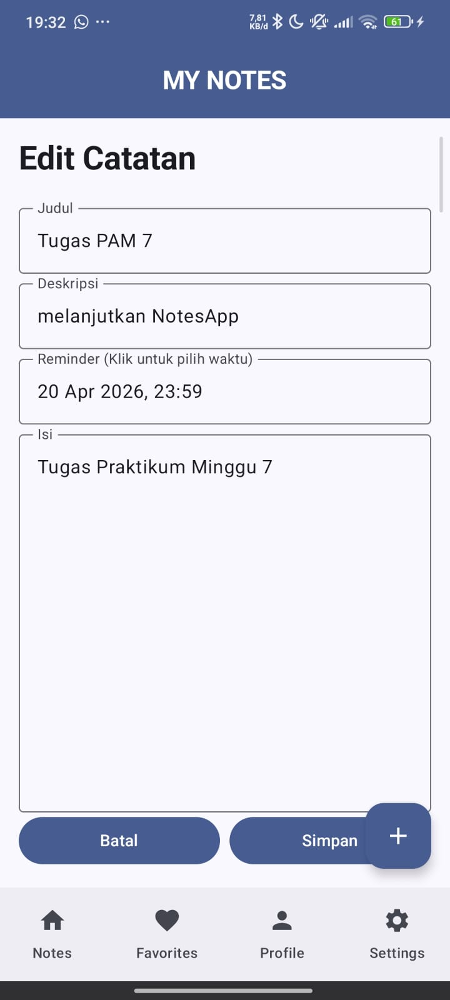
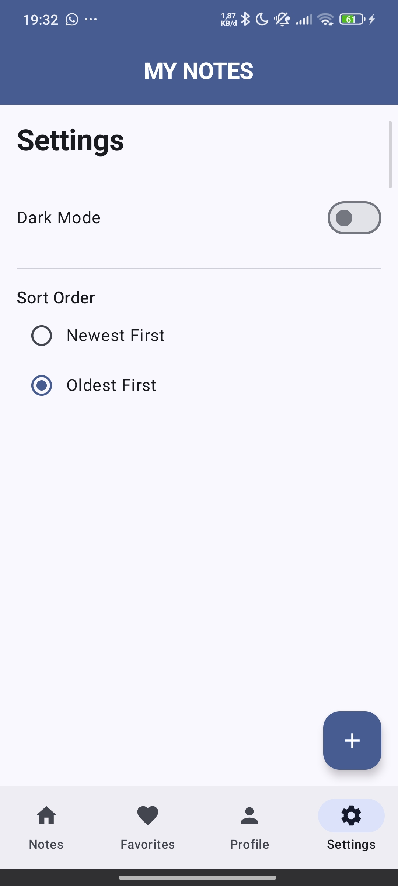
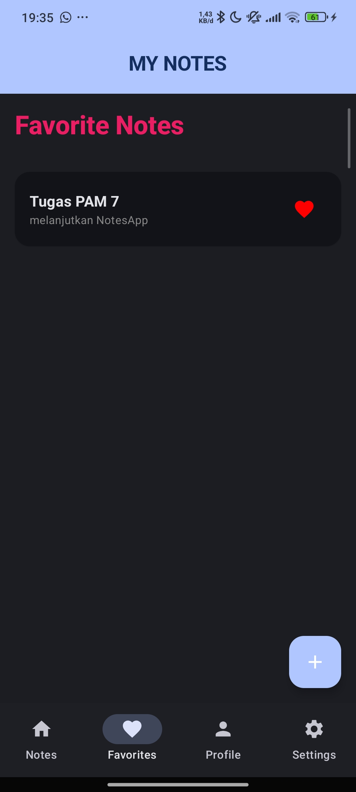
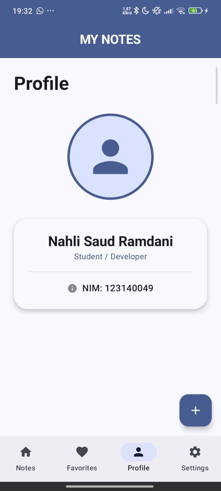

# Notes App Pro - Tugas Praktikum Minggu 7 📝

Aplikasi **Notes App** versi upgrade yang dioptimasi untuk **Tugas Praktikum Minggu 7**. Project ini mendemonstrasikan implementasi database lokal menggunakan **SQLDelight**, manajemen preferensi dengan **DataStore**, serta fitur pencarian dan sinkronisasi data.

## Fitur Utama & Pembelajaran (Upgrade Minggu 7)

### 1. SQLDelight Database (Offline-First) 💾
- **Persistensi Data**: Catatan tersimpan secara lokal di SQLite melalui SQLDelight.
- **Full CRUD**: Implementasi lengkap Operasi Create, Read, Update, dan Delete.
- **Type-Safe Queries**: Penggunaan generator kode SQLDelight untuk query yang aman.

### 2. Fitur Pencarian & Sortir 🔍
- **Real-time Search**: Mencari catatan berdasarkan judul atau isi konten dengan fitur *debounce* (300ms) untuk performa optimal.
- **Custom Sorting**: Pengguna dapat memilih urutan catatan (Terbaru/Terlama) yang disimpan melalui DataStore.

### 3. Settings dengan Jetpack DataStore ⚙️
- **Theme Persistence**: Pengaturan *Dark Mode* yang tersimpan secara permanen.
- **Preference Storage**: Menggunakan DataStore Preferences untuk performa yang lebih baik dibanding SharedPreferences.

### 4. UI States & UX Lanjutan ✨
- **Proper States**: Penanganan kondisi *Loading* (Circular Progress), *Empty* (Tampilan khusus saat data kosong), dan *Content*.
- **Date & Time Picker**: Input reminder menggunakan dialog kalender dan waktu sistem yang intuitif.
- **Clean UI**: Tampilan modern menggunakan Material 3 dengan responsivitas tinggi.

### 5. Bonus: Remote API Sync 🌐
- **Ktor Integration**: Boilerplate integrasi Ktor Client untuk sinkronisasi data dengan API eksternal.

## Database Schema (SQLDelight)
Berikut adalah skema tabel yang digunakan dalam project ini:
```sql
CREATE TABLE noteEntity (
    id INTEGER NOT NULL PRIMARY KEY AUTOINCREMENT,
    title TEXT NOT NULL,
    description TEXT NOT NULL,
    content TEXT NOT NULL,
    reminder TEXT NOT NULL,
    isFavorite INTEGER NOT NULL DEFAULT 0, -- 0: False, 1: True
    createdAt INTEGER NOT NULL DEFAULT 0
);
```

## Tampilan Aplikasi

### Screenshot Update (Minggu 7)

| Home Screen | Detail Notes | Add Notes |
|:---:|:---:|:---:|
|  |  |  |

| Edit Notes | Settings | Dark Favorites |
|:---:|:---:|:---:|
|  |  |  |

| Profile |
|:---:|
|  |

## Struktur Layar
- **Home**: Daftar catatan dengan fitur pencarian dan toggle favorit.
- **Settings**: Pengaturan tema dan urutan sortir.
- **Favorites**: Koleksi catatan yang telah ditandai.
- **Profile**: Informasi pengguna (Nahli Saud Ramdani - 123140049).
- **Add/Edit**: Form input catatan dengan dialog pemilihan waktu.

## Teknologi yang Digunakan
- **SQLDelight**: Manajemen database lokal.
- **Jetpack DataStore**: Manajemen preferensi pengguna.
- **Ktor Client**: Networking & API Sync (Bonus).
- **Jetpack Compose**: UI Toolkit.
- **Compose Navigation**: Navigasi antar layar.
- **Material 3**: Standar desain terbaru.

---
**Oleh:**
- Nahli Saud Ramdani (123140049)
