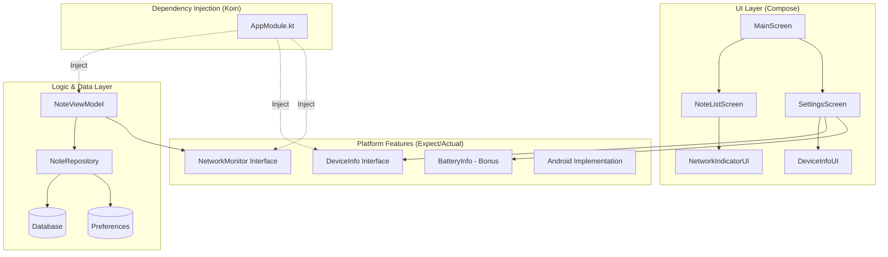
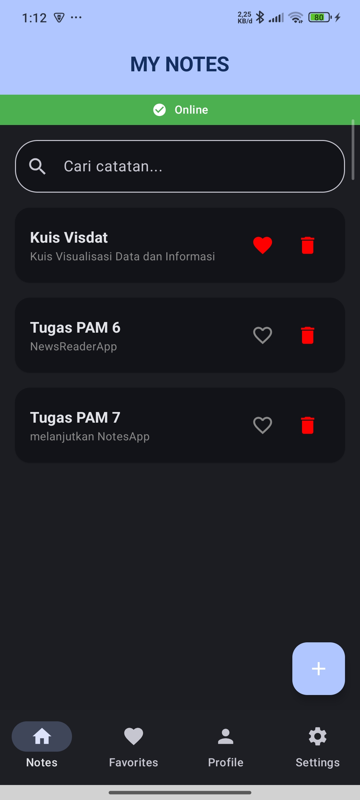
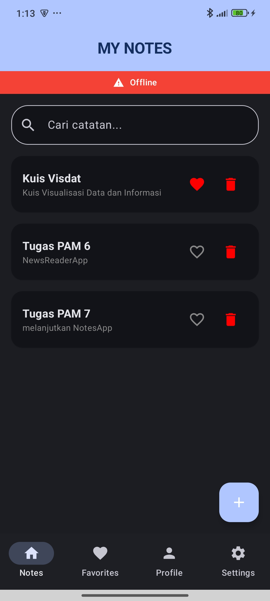
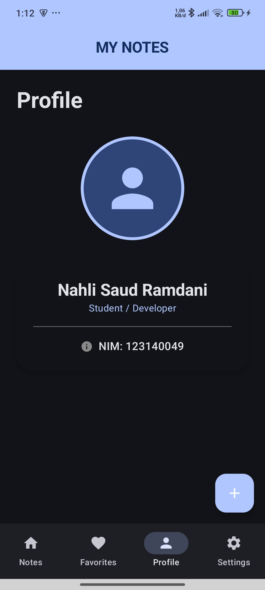

# TUGAS PRAKTIKUM MINGGU 8 - Notes App Upgrade 🚀

Aplikasi ini telah di-upgrade dengan fitur platform dan implementasi **Dependency Injection** menggunakan **Koin**.

---

## 🏗️ Architecture Diagram

Project ini mengadopsi struktur modular dengan pemisahan tanggung jawab yang jelas:

---

## 📝 Deskripsi Tugas

1.  **Koin DI Setup**: Implementasi penuh Koin untuk menyuntikkan (inject) Repository, ViewModel, dan Platform Services.
2.  **DeviceInfo (expect/actual)**: Abstraksi untuk mengambil info hardware perangkat.
3.  **NetworkMonitor (expect/actual)**: Memantau konektivitas secara reaktif dengan Flow.
4.  **Device Info UI**: Menampilkan informasi sistem di dalam menu Settings.
5.  **Network Status UI**: Menampilkan bar indikator Online/Offline di layar utama.
6.  **Full Injection**: Semua komponen didefinisikan dalam modul Koin.

---

## ✅ Rubrik Penilaian

| Komponen | Bobot | Status |
| :--- | :---: | :--- |
| **Koin DI Setup** | 25% | Terimplementasi (AppModule & Application class) |
| **expect/actual Pattern** | 25% | Terimplementasi (DeviceInfo & NetworkMonitor) |
| **UI Integration** | 20% | Terimplementasi (Home & Settings Screen) |
| **Architecture** | 20% | Clean separation & proper package modules |
| **Code Quality** | 10% | Clean code & Documentation |
| **Bonus ⭐** | +10% | **BatteryInfo expect/actual implementation** |

---

## 📸 Screenshots

| Home (Online) | Settings (Device & Battery) |
| :---: | :---: |
|  |  |

| Home (Offline) | Profile & Favorites |
| :---: | :---: |
|  |  |

---

## 🎥 Video Demo
Link Video (45 detik): [YouTube / Drive Link](URL_VIDEO_DEMO)
*(Menunjukkan: Koin DI, Device Info, Network Status, & Battery Info)*

---
**Identitas Mahasiswa:**
- **Nama**: Nahli Saud Ramdani
- **NIM**: 123140049
- **Branch**: `week-8`

---
*Pengembangan Aplikasi Mobile - ITERA*
