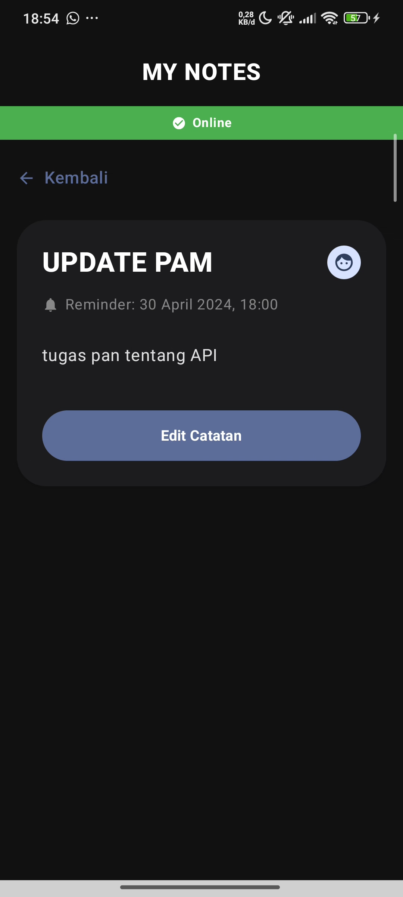

# Tugas Praktikum 9 - MY NOTES

#### Nama : Nahli Saud Ramdani
#### NIM  : 123140049

## Deskripsi
**MYNOTES** adalah aplikasi pencatat (note-taking) berbasis **Kotlin Multiplatform (KMP)** yang dirancang untuk membantu pengguna mengelola catatan harian dengan fitur cerdas. Aplikasi ini mengintegrasikan **Gemini AI** untuk fitur penerjemahan isi catatan ke berbagai bahasa.

Aplikasi ini mendukung fungsionalitas CRUD dasar untuk catatan, fitur favorit, pengingat (reminder), serta manajemen profil dan pengaturan tampilan (Dark Mode). Selain itu, aplikasi ini juga menampilkan informasi perangkat dan status baterai secara real-time.

## Fitur Utama
- **Manajemen Catatan**: Menambah, mengedit, melihat detail, dan menghapus catatan.
- **Pencarian**: Mencari catatan berdasarkan judul atau deskripsi.
- **Favorit**: Menandai catatan penting sebagai favorit.
- **Reminder**: Menambahkan pengingat waktu pada setiap catatan.
- **AI Translation**: Menerjemahkan isi catatan ke bahasa Inggris, Indonesia, atau Jepang menggunakan **Gemini API**.
- **Dark Mode**: Mendukung tema gelap dan terang untuk kenyamanan mata.
- **Sorting**: Mengurutkan catatan dari yang terbaru atau terlama.
- **Connectivity Status**: Menampilkan banner status koneksi (Online/Offline).
- **Device & Battery Info**: Menampilkan model perangkat, versi OS, serta level dan status baterai.

## AI Integration
Aplikasi menggunakan **Gemini API** untuk memproses teks dalam catatan. Fitur utama AI saat ini adalah **Translate AI**, di mana pengguna dapat memilih untuk menerjemahkan isi catatan ke bahasa lain secara instan.

Alur AI:
1. Pengguna membuka layar edit catatan.
2. Memilih menu Translate dan menentukan bahasa target.
3. Aplikasi mengirim konten catatan dan instruksi (prompt) ke Gemini API.
4. Hasil terjemahan diterima dan langsung memperbarui kolom isi catatan.
5. Menampilkan loading state (AI Sedang Bekerja...) selama proses berlangsung.

## Prompt Engineering
Prompt yang digunakan dirancang untuk memberikan hasil terjemahan yang akurat dan ringkas:
- **Instruksi**: `Translate the following text to [Target Language]. Provide only the translated text without any explanations.`
- Hal ini memastikan AI hanya mengembalikan hasil terjemahan murni tanpa tambahan teks basa-basi dari asisten AI.

## Error Handling
Aplikasi menangani berbagai skenario kesalahan untuk menjaga pengalaman pengguna:
- **Validasi Input**: Judul catatan tidak boleh kosong saat menyimpan.
- **API Error**: Menangani kegagalan saat menghubungi Gemini API dengan pesan error yang deskriptif.
- **Network Status**: Menggunakan banner konektivitas untuk memberitahu pengguna jika perangkat sedang offline.
- **Loading State**: Memberikan feedback visual saat AI sedang memproses terjemahan.

## Cara Menjalankan (Android Studio)
1. Clone / download repository ini.
2. Buka folder project menggunakan Android Studio.
3. Tunggu proses **Gradle Sync** sampai selesai.
4. Jalankan aplikasi pada emulator atau perangkat fisik Android.

## Screenshot Aplikasi

<table>
  <tr>
    <td align="center"><b>1. Sebelum Translate</b></td>
    <td align="center"><b>2. Sesudah Translate</b></td>
    <td align="center"><b>3. Detail Catatan</b></td>
  </tr>
  <tr>
    <td></td>
    <td></td>
    <td></td>
  </tr>
</table>
